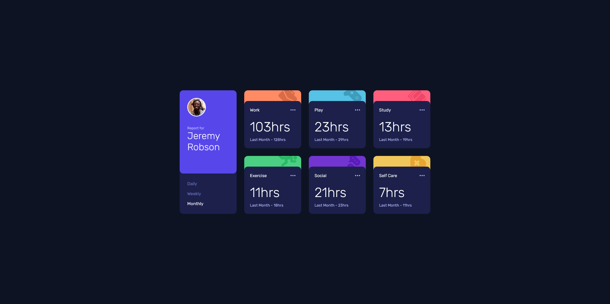

# Frontend Mentor - Time Tracking Dashboard Solution

This is my solution to the [Time Tracking Dashboard Challenge](https://www.frontendmentor.io/challenges/time-tracking-dashboard-UIQ7167Jw) on **Frontend Mentor**.  
This project helped me improve my **JavaScript**, **JSON handling**, and **CSS debugging** skills.

## Table of Contents
- [Overview](#overview)
  - [The Challenge](#the-challenge)
  - [Screenshot](#screenshot)
  - [Links](#links)
- [My Process](#my-process)
  - [Built With](#built-with)
  - [What I Learned](#what-i-learned)
  - [Continued Development](#continued-development)
  - [Useful Resources](#useful-resources)
- [Author](#author)
- [Acknowledgments](#acknowledgments)

---

## Overview

### The Challenge
Users should be able to:
- View the optimal layout depending on device screen size
- See hover states for all interactive elements
- Switch between **Daily**, **Weekly**, and **Monthly** stats

### Screenshot


### Links
- **Live Site URL**: [https://d0bbysocks.github.io/TimeTrackingDashboard/](https://d0bbysocks.github.io/TimeTrackingDashboard/)
- **Solution URL**: *coming soon*

---

## My Process

### Built With
- Semantic HTML5 markup
- CSS Custom Properties
- Flexbox
- CSS Grid
- Mobile-first workflow
- JSON module import  


### What I Learned

This project taught me a few important things.
1. Importing and using JSON modules
This was my first time importing JSON directly as a module:

  ```js
  import data from "./data.json" with { type: "json" };
 ```

### Key takeaways:

- JSON imports in modern environments require the with { type: "json" } flag.
- I learned how to structure and access the JSON data for different timeframes (daily, weekly, monthly).
- The UI updates dynamically based on the selected period, using data from the JSON file.

## 2. Safe DOM selection
I used safe DOM selection to avoid errors if elements are missing:
 ```js
const timeframeButtons = document.querySelectorAll('.timeframe-btn');
const cards = document.querySelectorAll('.stat-card');

if (!timeframeButtons.length || !cards.length) {
  console.error('Required elements not found in DOM');
}
 ```


 This prevents runtime errors during development and improves robustness.

## Continued Development
In future projects, I want to focus on:

- Implementing TypeScript for better type safety with JSON data
- Adding smooth transitions between timeframe switches
- Exploring CSS Grid areas for more complex layouts


## Useful Resources

MDN Web Docs - Static Import of JSON – Official docs on JSON module imports
Frontend Mentor Community – Great feedback and inspiration


Author

GitHub: @d0bbysocks
Frontend Mentor: @d0bbysocks


Acknowledgments
Special thanks to the Frontend Mentor community for the challenge and feedback.
Also shoutout to everyone who helped debug my JSON import issues on Stack Overflow!